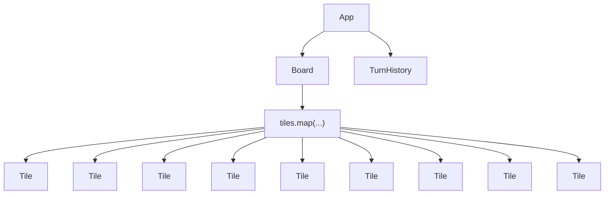
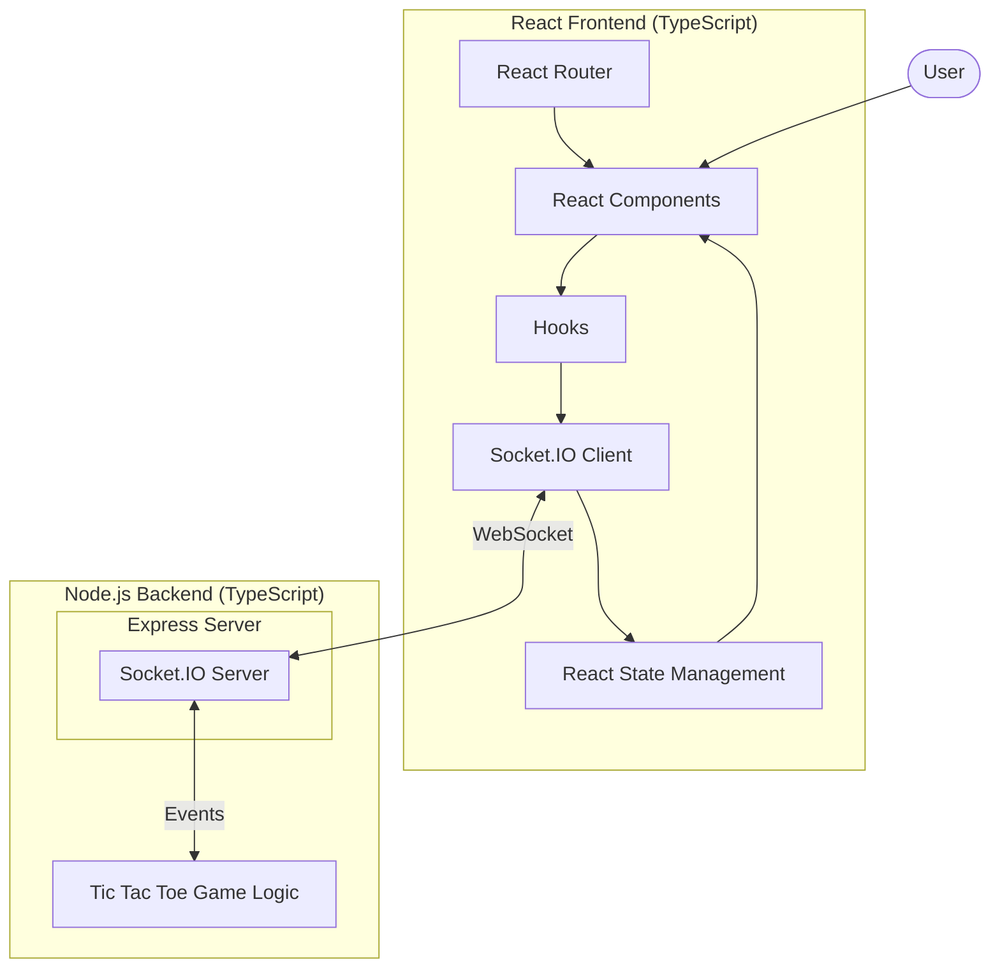

# tic-tac-toe react app

uses the antd component library and playwright for end to end tests, jest for unit tests

React App (tic-tac-toe or naughts & crosses) that demonstrates usage of widely used react
concepts:

- hooks
- custom hooks
- component driven design/composition
- usage of memo and useCallback
- usage of useRef and "low level" html canvas drawing/abstraction

## React UI Render Tree for practise mode

## architectural diagram for web socket online play with react 

## running app in dev environment

### running server

cd into server and run: 

`npm i` to install dependencies 

then: `npm run dev` to start server 

### running client

`npm i` to install dependencies 

`npm run start` to run react app

## running app in production environment

from root run `npm run build`

from /server run `npm run build`

from /server then run `NODE_ENV=production npm run start`

## running tests

`npm run test` for unit tests (jest)

`npx playwright install` install playwright browsers

`npm run test:e2e` for playwright headless tests (playwright)

`npm run test:e2e:headed` for headed tests (playwright)

`npm run test:e2e:ui` for inspecting and debugging tests individually (playwright)
