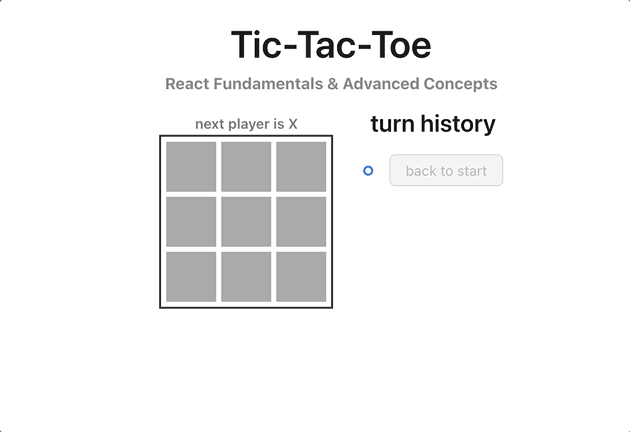
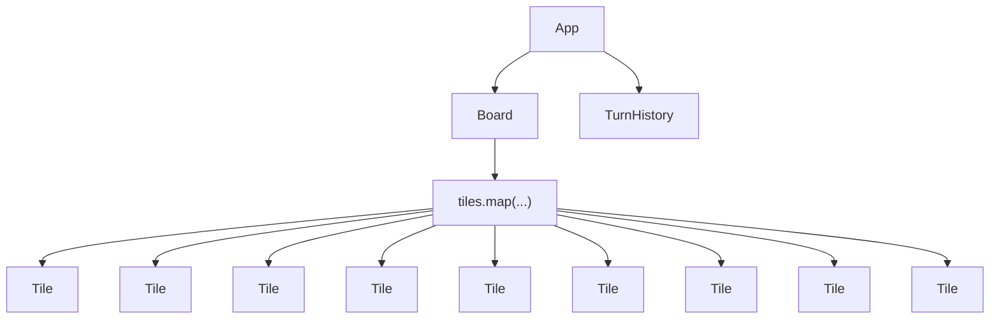

# tic-tac-toe react app

React App (tic-tac-toe or naughts & crosses) that demonstrates usage of widely used react
concepts:

- hooks
- custom hooks
- component driven design/composition

## React UI Render Tree

uses the antd component library and playwright for end to end tests, jest for unit tests

## running app

`npm i` to install

`npm run start` to run

## running tests

`npm run test` for unit tests (jest)

`npx playwright install` install playwright browsers

`npm run test:e2e` for playwright headless tests (playwright)

`npm run test:e2e:headed` for headed tests (playwright)

`npm run test:e2e:ui` for inspecting and debugging tests individually (playwright)
